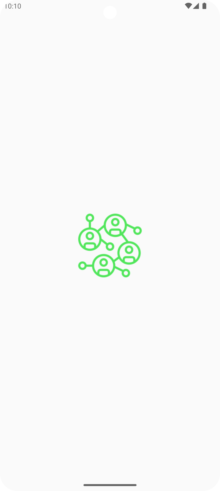
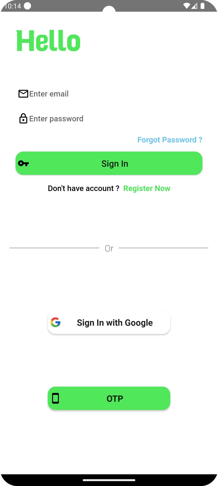
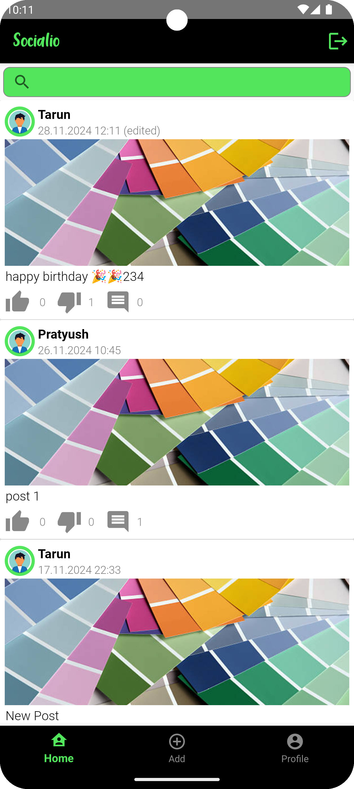
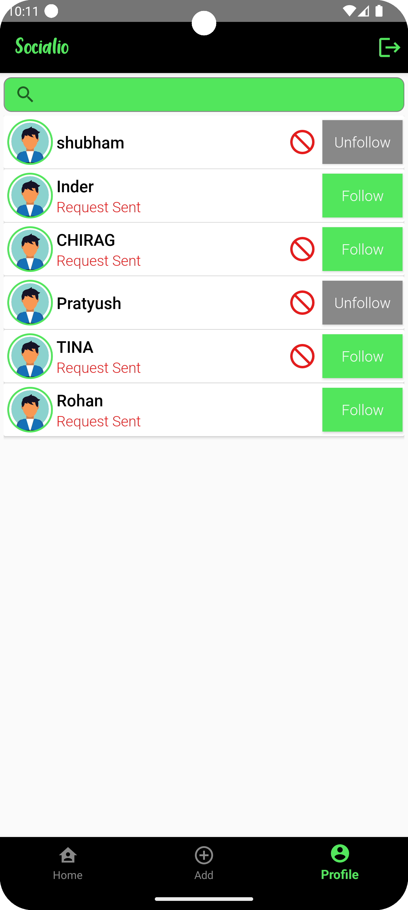
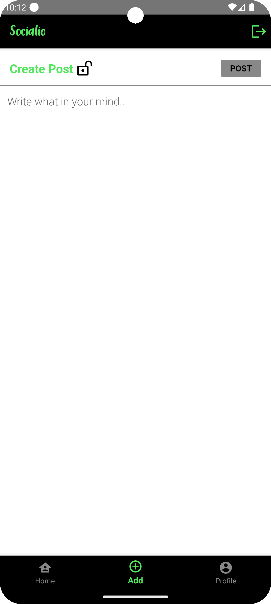
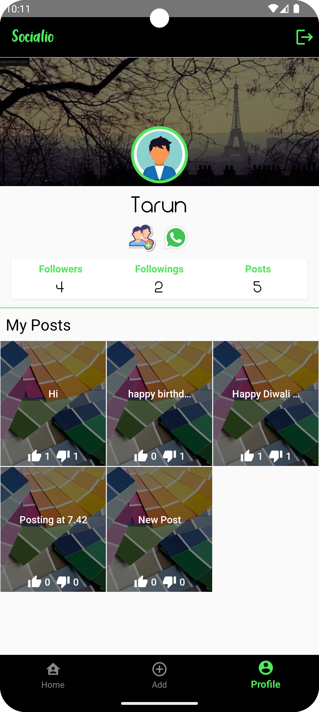
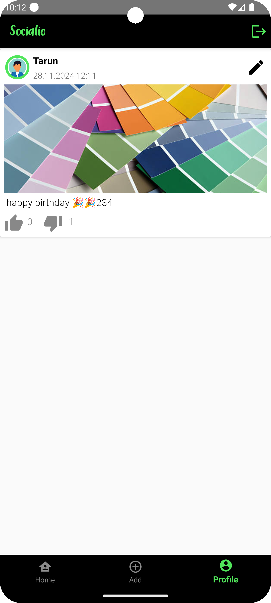

<h1 style="font-size:48px;">🌟 Socialio</h1>

Welcome to **Socialio**, a sleek and simple social media application built for Android. Designed as a project to demonstrate essential social media features, Socialio enables users to connect, share, and interact seamlessly.

<h2 style="font-size:36px;"> ✨ Features</h2>

- 🔒 **Secure User Authentication**: Sign up and log in securely.
- 🧑‍🎤 **Profile Management**: Create and customize your profile.
- 📝 **Post Creation**: Share your thoughts and updates with ease.
- ❤️ **Interactions**: Like and comment on posts.
- 📜 **Feed Display**: Stay updated with a clean and intuitive feed.

<h2 style="font-size:36px;"> 🚀 Installation</h2>

- Clone the Repository : git clone https://github.com/divyam082003/socialio.git

<h2 style="font-size:36px;">Screenshots</h2>

  
  
  
  
  
  
  

